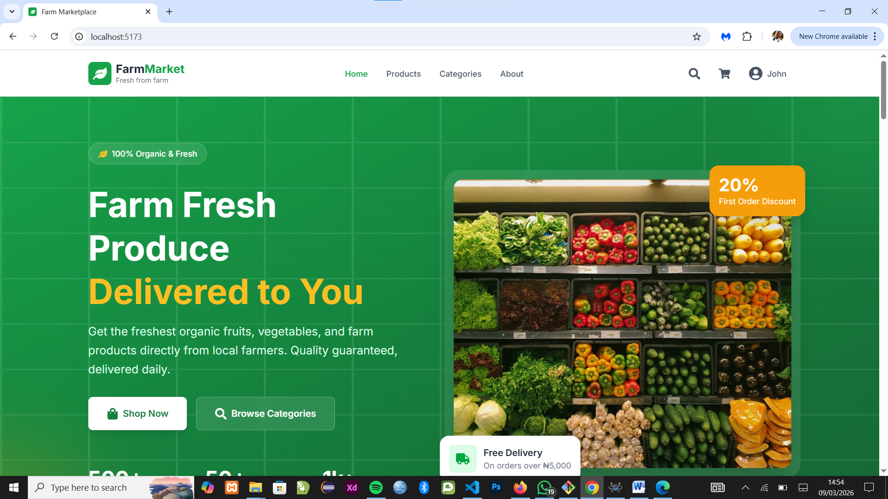
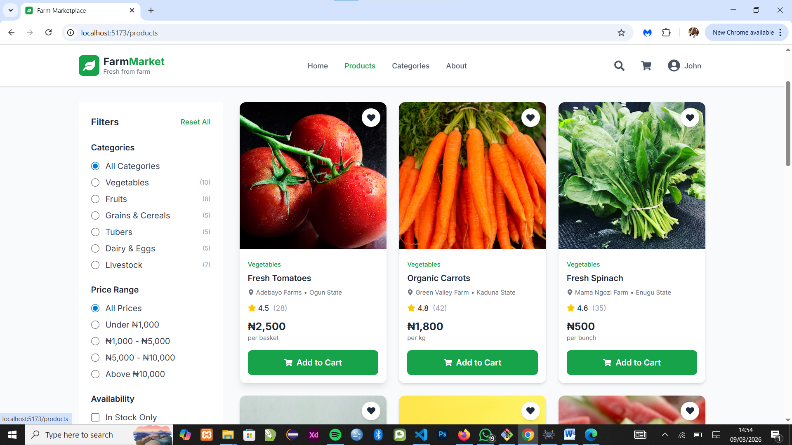
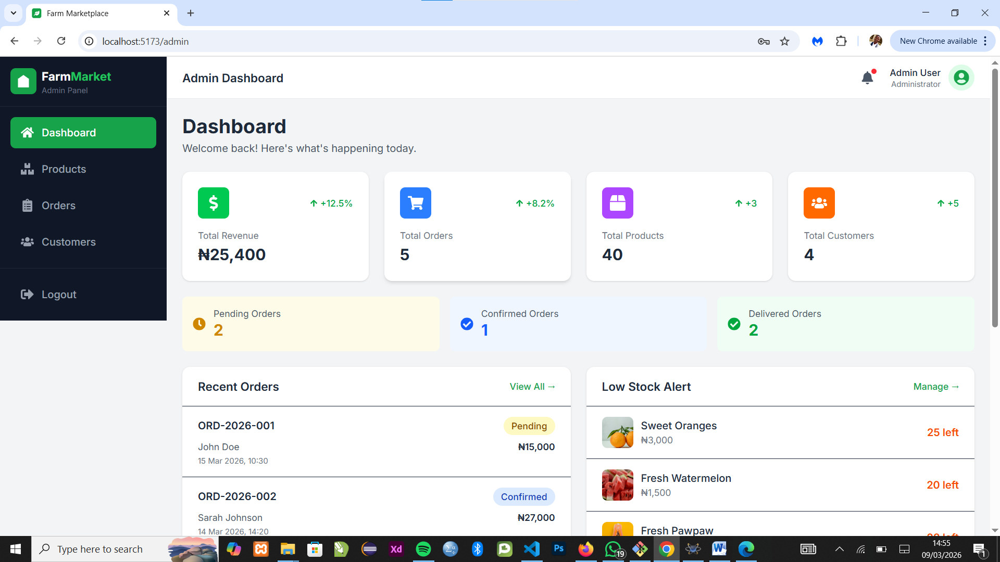

# Farm Marketplace - README

Here's a professional, human-written README for your project:

---

```markdown
# 🌾 FarmMarket - Fresh Produce Marketplace

A modern web platform connecting local farmers directly with consumers for fresh, organic farm produce delivery.


## 📋 About The Project

FarmMarket is a marketplace platform designed to bridge the gap between local farmers and consumers in Nigeria. The platform enables farmers (through their management) to list fresh produce, while buyers can browse, order, and receive farm-fresh products delivered to their doorstep.

### The Problem
- Farmers struggle to reach wider markets
- Consumers lack access to fresh, farm-direct produce
- Middlemen increase costs for both parties
- No transparent platform for farm-to-table transactions

### Our Solution
A user-friendly web application where:
- Admins manage product listings from multiple farmers
- Customers browse and purchase fresh produce online
- Orders are confirmed and fulfilled efficiently
- Both parties benefit from direct transactions

## ✨ Key Features

### For Customers (Buyers)
- 🛒 Browse 40+ fresh farm products across 6 categories
- 🔍 Search and filter products by category, price, and availability
- 🛍️ Add products to cart with real-time stock updates
- 📦 Place orders with delivery address specification
- 📱 Track order status (Pending → Confirmed → Delivered)
- 👤 Manage profile and view order history
- 💳 Cash on delivery payment option

### For Administrators
- 📊 Dashboard with key metrics and statistics
- 📦 Product management (Add, Edit, Delete, Stock tracking)
- 📋 Order management (View, Confirm, Mark as delivered)
- 👥 Customer database and insights
- 🚨 Low stock alerts
- 📈 Revenue and sales tracking

### Technical Features
- ⚡ Fast and responsive user interface
- 📱 Mobile-first design
- 🔐 Secure authentication system
- 💾 Persistent shopping cart (LocalStorage)
- 🎨 Professional UI with Tailwind CSS
- ♿ Accessible and user-friendly

## 🛠️ Built With

- **Frontend Framework:** React 18
- **Build Tool:** Vite
- **Styling:** Tailwind CSS v4
- **Routing:** React Router v6
- **State Management:** React Context API
- **Icons:** React Icons
- **Image Hosting:** Unsplash API
- **Deployment:** Vercel

## 🚀 Getting Started

### Prerequisites

- Node.js
- npm 

### Installation

1. Clone the repository
```bash
git clone https://github.com/confidencestanley/farm-marketplace.git
```

2. Navigate to project directory
```bash
cd farm-marketplace
```

3. Install dependencies
```bash
npm install
```

4. Start development server
```bash
npm run dev
```

5. Open your browser and visit
```
http://localhost:5173
```

## 👥 User Accounts (Demo)

### Admin Account
- **Email:** admin@farmmarket.com
- **Password:** admin123

### Buyer Account
- **Email:** buyer@gmail.com
- **Password:** buyer123

### Additional Test Account
- **Email:** sarah@gmail.com
- **Password:** sarah123

## 📱 Usage Guide

### As a Customer

1. **Browse Products**
   - Visit the home page to see featured products
   - Navigate to "Products" to view all items
   - Use filters to find specific categories

2. **Add to Cart**
   - Click "Add to Cart" on any product
   - Adjust quantities directly from the cart
   - View cart total and delivery fees

3. **Checkout**
   - Click "Proceed to Checkout"
   - Login or create an account
   - Fill in delivery information
   - Place your order

4. **Track Orders**
   - Go to "My Orders" to see all your orders
   - Check order status and delivery updates
   - View order details and items

### As an Administrator

1. **Manage Products**
   - Access admin panel at `/admin`
   - Add new products with images and details
   - Update stock levels and prices
   - Mark products as available/unavailable

2. **Process Orders**
   - View all pending orders
   - Confirm orders after verification
   - Mark orders as delivered after fulfillment
   - Track order history and revenue

3. **Monitor Business**
   - View dashboard for key metrics
   - Check low stock alerts
   - Monitor customer activity
   - Generate insights from order data

## 📂 Project Structure

```
farm-marketplace/
├── src/
│   ├── assets/          # Images and static files
│   ├── components/      # Reusable components
│   │   ├── admin/      # Admin-specific components
│   │   ├── buyer/      # Customer-facing components
│   │   └── common/     # Shared components
│   ├── context/        # React Context for state management
│   ├── data/           # Mock data (products, users, orders)
│   ├── layouts/        # Page layouts (Buyer, Admin, Auth)
│   ├── pages/          # Page components
│   │   ├── admin/     # Admin pages
│   │   ├── auth/      # Login & Register
│   │   └── buyer/     # Customer pages
│   ├── routes/        # Route protection logic
│   ├── utils/         # Helper functions
│   ├── App.jsx        # Main app component
│   └── main.jsx       # App entry point
├── public/            # Public assets
├── package.json       # Dependencies and scripts
└── README.md         # You are here!
```


## 📝 License

This project is created for educational purposes as part of a university coursework.

## 👨‍💻 Author

**Your Name**
- University: The Federal University Of Technology Ilaro
- Department: Computer Science
- LinkedIn: confidenceohireimen
- GitHub: https://github.com/confidencestanley


## 📸 Screenshots

### Home Page


### Products Page


### Admin Dashboard

